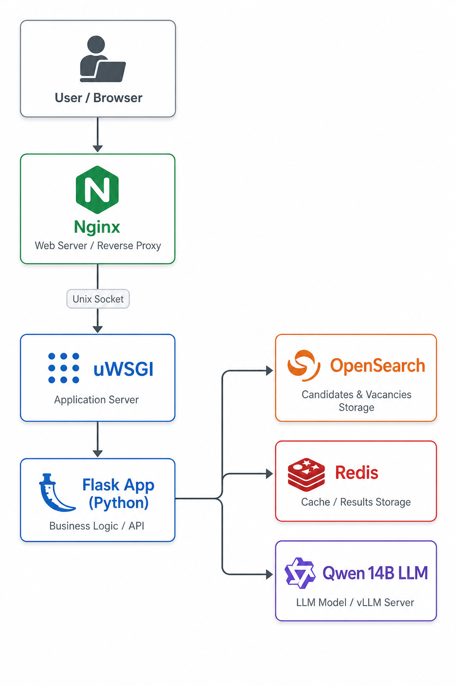
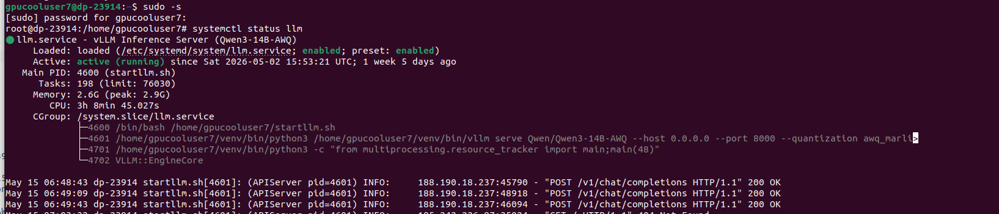

# Проект по ранжированию кандидатов для Газпром-Нефти

## Описание проекта

Данный проект позволяет загружать вакансии в формате PDF из HH.ru и любые текстовые вакансии в свободной форме. Разработан собственный механизм парсинга
вакансии из PDF HH.ru и запись их в Opensearch Парсинг вакансий в свободной форме осуществляеться через запрос к LLM модели Qwen/Qwen3-14B-AWQ развернутой на своем сервере и последующей
записью данных вакансий в Opensearch

Для первичного ранжирования вакансий используется ансамбль из трех метрик:

**Косинусное расстоения по эмбеддингам полученные от модели intfloat/multilingual-e5-base:**

Текст резюме и вакансии преобразуются в числовые векторы - эмбеддинги. Косинусное расстояние измеряет угол между этими векторами: чем он меньше, тем ближе смысл текстов. 
Метрика хорошо улавливает смысловое сходство даже при разных формулировках например, "разработка моделей" и "построение ML-пайплайнов" будут близки в векторном пространстве.

**Количество вхождения одинаковых слов в тексте вакансии/резюме по методу Jaccard'a**

Метрика считает отношение числа общих слов между вакансией и резюме к общему количеству уникальных слов в обоих текстах. 
Дает понятный и интерпретируемый результат: чем больше терминов из вакансии встречается в резюме кандидата, тем выше оценка. Хорошо работает для технических требований вроде названий инструментов и технологий.

**TF-IDF между тегами вакансии и тегами резюме**

Из вакансии и резюме извлекаются ключевые теги. TF-IDF взвешивает их по важности: редкие и специфичные теги получают больший вес, чем частые и общие. 
Это позволяет точнее оценить соответствие по ключевым требованиям, не давая общим словам искажать результат.

По среднему из данных трех метрик мы делаем первичное ранжирование вакансий

Для финального выбора кандидатов используются последовательные запросы к Qwen модели для вывода следующей информации:

- Рейтинг подходимости кандидата под данную вакансию от 1 до 10
- Соответсвие требованиям вакансии
- Сильные стороны кандидата
- Риски при найме
- Вывод
- Обратная связь он же тактичный текст отказа

## Архитектура приложения

Приложение построено на микросервисной архитектуре. Код написан на Python на фреймворке Flask. Для запуска кода используется uwsgi. Через сокет идет обработка 
запросов nginx. Отдельно запущен микросервис Opensearch для записи и вывода кандидатов. Через кеширование Redis идет вывод ранжированных кандидатов и вывод 
ответа от финального анализа кандидатов через модель Qwen

  

## Скриншот с сервера Qwen



## Инструкция по запуску


### Linux

```aiignore
git clone https://github.com/learn2pr0ge/bluetreasure.git
cd bluetreasure
```

Должен быть установлен Docker и Docker Compose

```aiignore
./start.sh
```


### Windows

**Требования:** Должен быть установлен и запущен [Docker Desktop](https://www.docker.com/products/docker-desktop/).

1. Клонируй репозиторий (через Git Bash или PowerShell):

```powershell
git clone https://github.com/learn2pr0ge/bluetreasure.git
cd bluetreasure
```

2. Запусти скрипт запуска:


- **Через Docker Compose:**
```powershell
docker compose up --build
```

> **Примечание:** На Windows убедись, что Docker Desktop запущен перед выполнением команд. 


## Возможна небольшая задержка при первом открытии в районе 3-4 минут из-за скачивания модели эмбедингов intfloat/multilingual-e5-base
## Заходите браузером на localhost и наслаждайтесь
# Удачного использования и хорошего настроения!